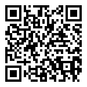

# go-qr  
A library written in Golang, designed to generate Quick Response (QR) codes from text. The library leverages the power of Golang to provide a simple and efficient solution for generating QR codes.

## Features

- Generates QR codes from text.
- Configurable options for QR code size, error correction level, and encoding mode.
- Allows saving QR codes as images or printing them in the terminal.
- Customizable QR code colors.
- Lightweight and fast implementation.


## Installation
`go get -u github.com/psxzz/go-qr`
## Usage

```go
package main

import (
    "fmt"
    "image/png"
    "os"
    
    "github.com/psxzz/go-qr/pkg/qr"
)

func main() {
    const imageSize = 1480
    
    encoder := qr.NewEncoder(qr.WithCorrectionLevel(qr.H))
    code, _ := encoder.Encode("https://github.com/psxzz/go-qr")
    
    fmt.Printf("code: %v\n", code)
    
    img, _ := code.GetImage(imageSize)
    f, _ := os.Create("qr.png")
    png.Encode(f, img)
}
```
## Customizing QR Code Colors

```go
encoder := qr.NewEncoder(qr.WithCorrectionLevel(qr.H))
code, _ := encoder.Encode("https://github.com/psxzz/go-qr")

white, pink := color.RGBA{R: 255, G: 255, B: 255, A: 0xff}, color.RGBA{R: 227, G: 61, B: 148, A: 0xff}
img, _ := code.GetImageWithColors(imageSize, white, pink)
```
## Roadmap

The following are the planned future enhancements for the go-qr library:

- **QR Decoder**: Implement a QR code decoder to decode and extract information from existing QR codes. 
- **Code Coverage**: Increase code coverage by writing comprehensive tests to ensure the reliability and stability of the library.
- **Performance Benchmarking**: Conduct performance benchmarking to optimize the library speed and efficiency, with the main goal of becoming the fastest library among other implementations in Go.
- **Additional encoding modes**: alphanumeric, numeric, and kanji.
- **More output formats**: JPEG, SVG.
## Contributing

Contributions to the go-qr project are welcome! If you encounter any issues, have suggestions, or want to contribute improvements or new features, please feel free to submit a pull request.

Before submitting a pull request, make sure to:

- Follow the existing code style and conventions.
- Provide a clear and concise description of the changes made.

## References

- [Wikipedia](https://en.wikipedia.org/wiki/QR_code)
- [ISO/IEC 18004:2015](https://www.iso.org/standard/62021.html)

## License

This library is open-source and released under the [MIT License](https://opensource.org/license/mit/). Feel free to use, modify, and distribute it as per the license terms.

## Credits

The go-qr library is developed and maintained by [@psxzz](https://github.com/psxzz) and [@adanil](https://github.com/adanil). 
"QR Code" is a registered Trade Mark of Denso Wave Incorporated.
